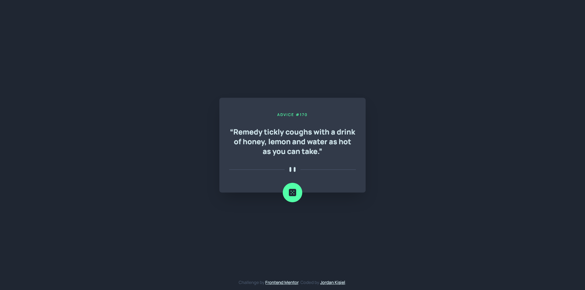

# Frontend Mentor - Advice generator app solution

This is a solution to the [Advice generator app challenge on Frontend Mentor](https://www.frontendmentor.io/challenges/advice-generator-app-QdUG-13db). Frontend Mentor challenges help you improve your coding skills by building realistic projects.

## Table of contents

- [Overview](#overview)
  - [The challenge](#the-challenge)
  - [Screenshot](#screenshot)
  - [Links](#links)
- [My process](#my-process)
  - [Built with](#built-with)
  - [What I learned](#what-i-learned)
  - [Continued development](#continued-development)
  - [Useful resources](#useful-resources)
- [Author](#author)
- [Acknowledgments](#acknowledgments)

## Overview

### The challenge

Users should be able to:

- View the optimal layout for the app depending on their device's screen size
- See hover states for all interactive elements on the page
- Generate a new piece of advice by clicking the dice icon

### Screenshot

### Links

- Live Site URL: [https://jordankisiel.github.io/advice-generator/](https://jordankisiel.github.io/advice-generator/)

## My process

### Built with

- Semantic HTML5 markup
- Flexbox
- Mobile-first workflow
- [Tailwind](https://tailwindcss.com/) - CSS Framework
- Vanilla JS

### What I learned

This project was mostly an opportunity to tackle a slightly more complex JavaScript project. I learned about how to fetch JSON formatted data from an API and display it on my website.

### Continued development

I would like to continue tackling Javascript projects as I feel that my grasp on Tailwind is already quite good at this point.

### Useful resources

- [freeCodeCamp - JSON API's and AJAX](https://www.freecodecamp.org/learn/data-visualization/#json-apis-and-ajax) - This is where I learned how to use the fetch method to get JSON data from an API

## Author

- Website - [Jordan Kisiel](https://robojojo.co/)
- Frontend Mentor - [@JordanKisiel](https://www.frontendmentor.io/profile/JordanKisiel)
- Twitter - [@JordanKisiel](https://www.twitter.com/JordanKisiel)
